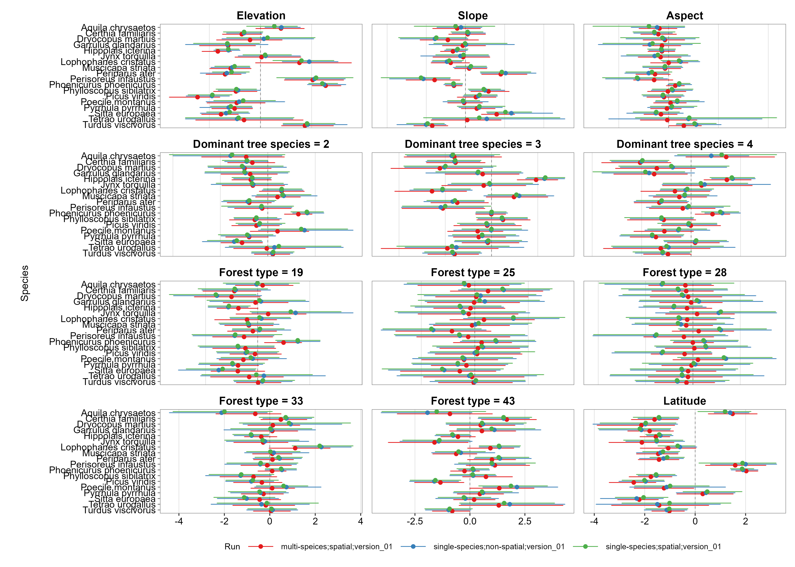
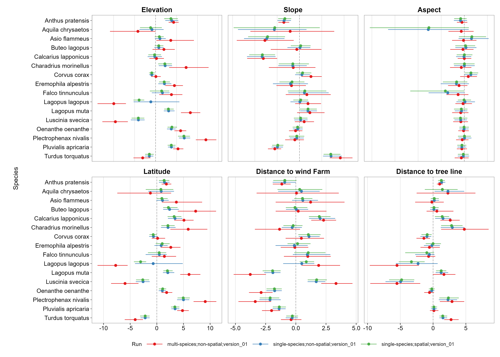
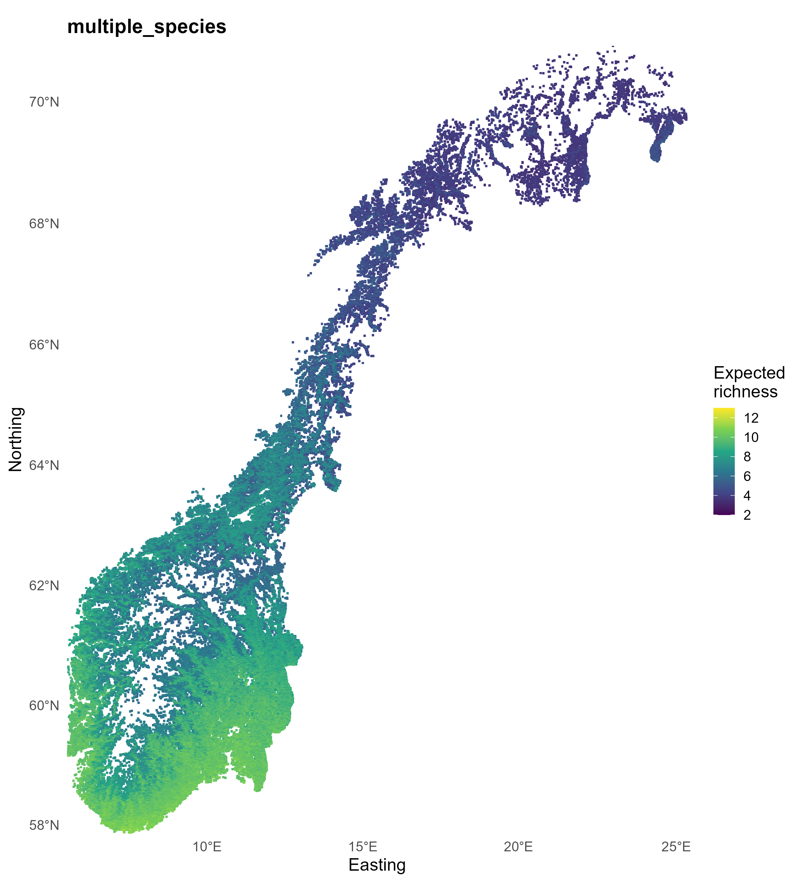
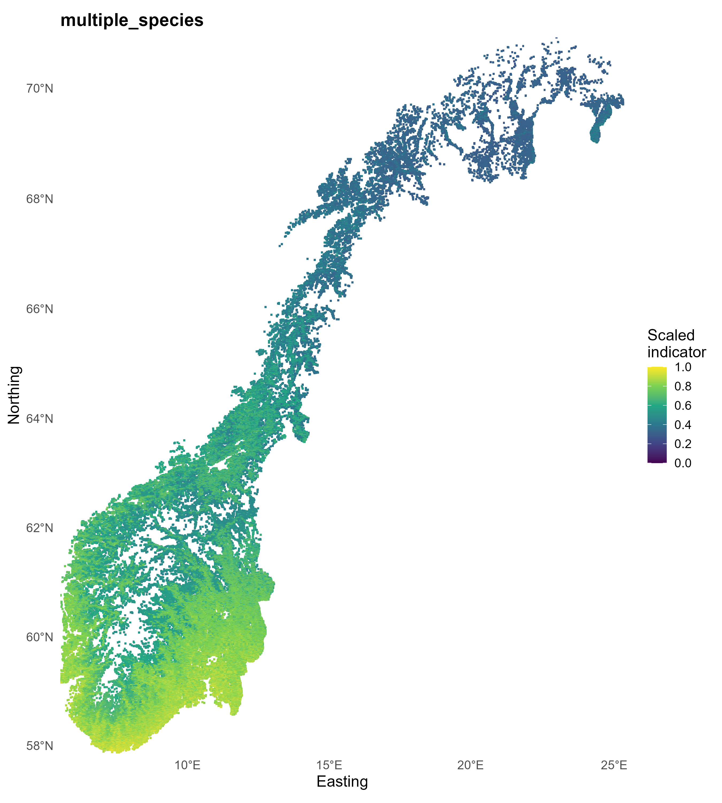
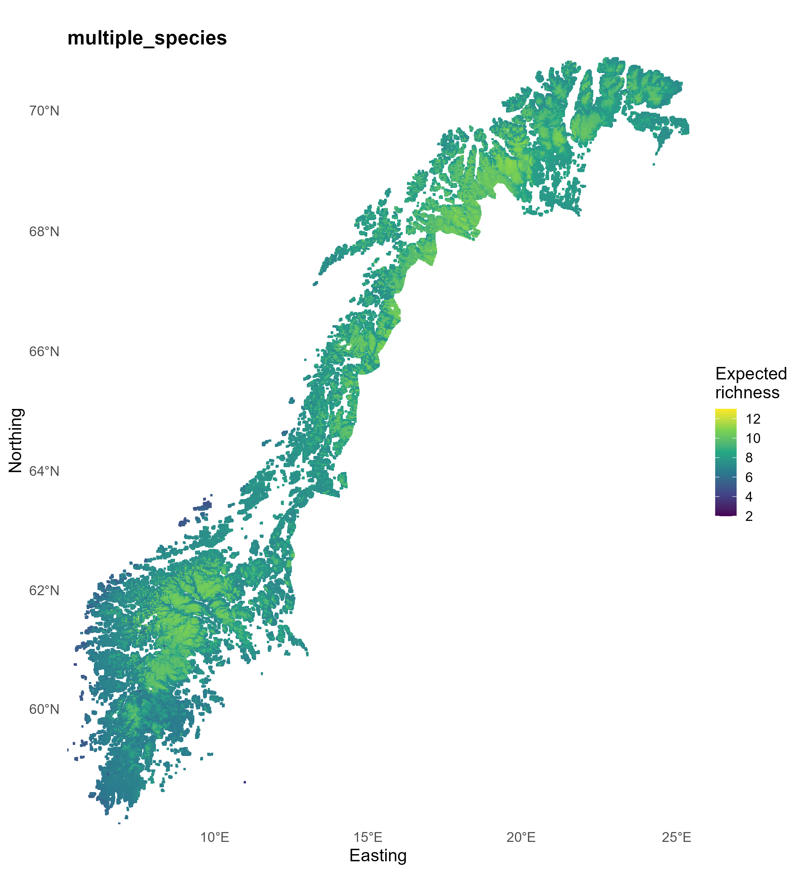
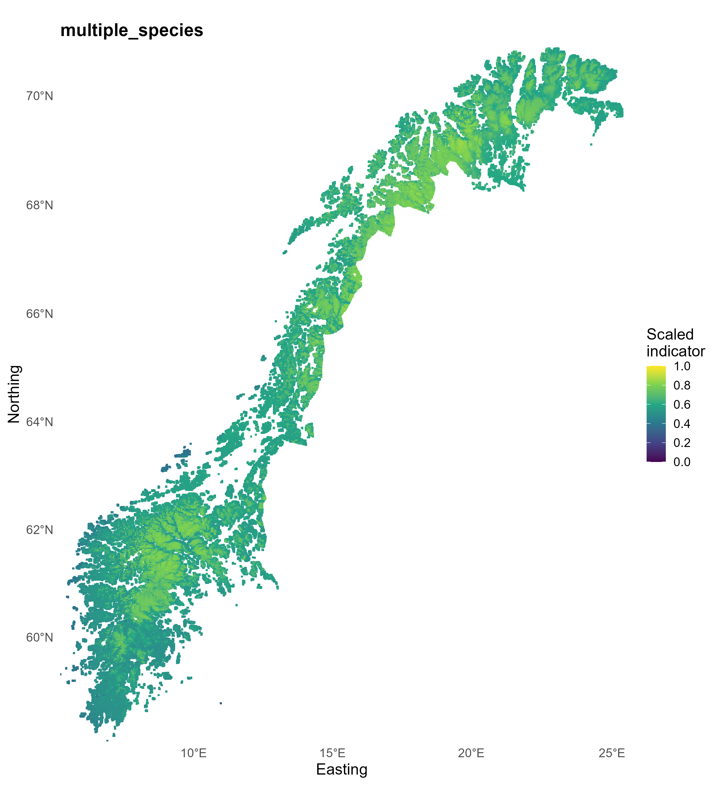
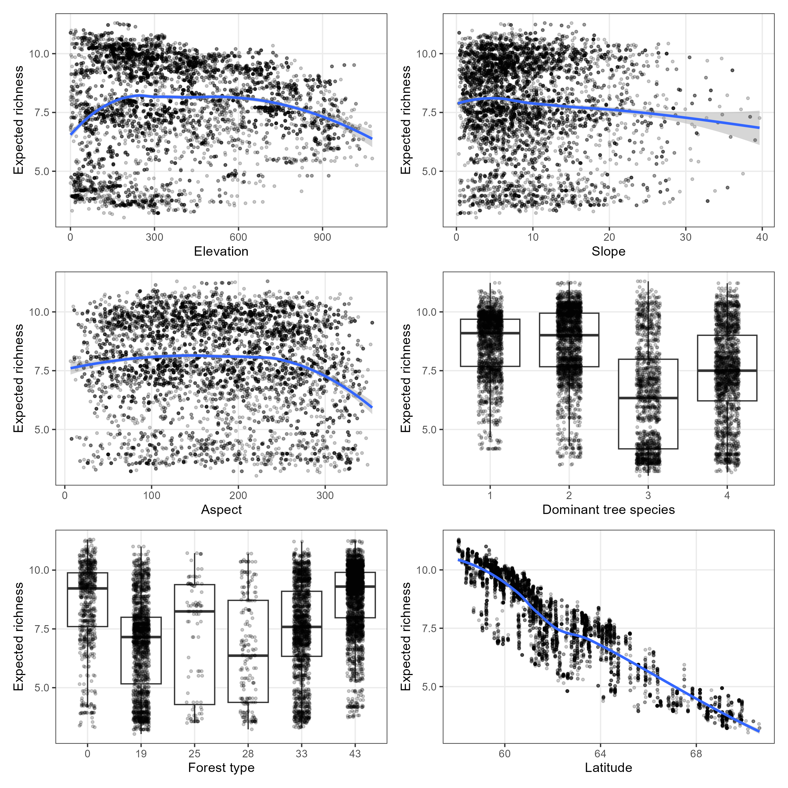
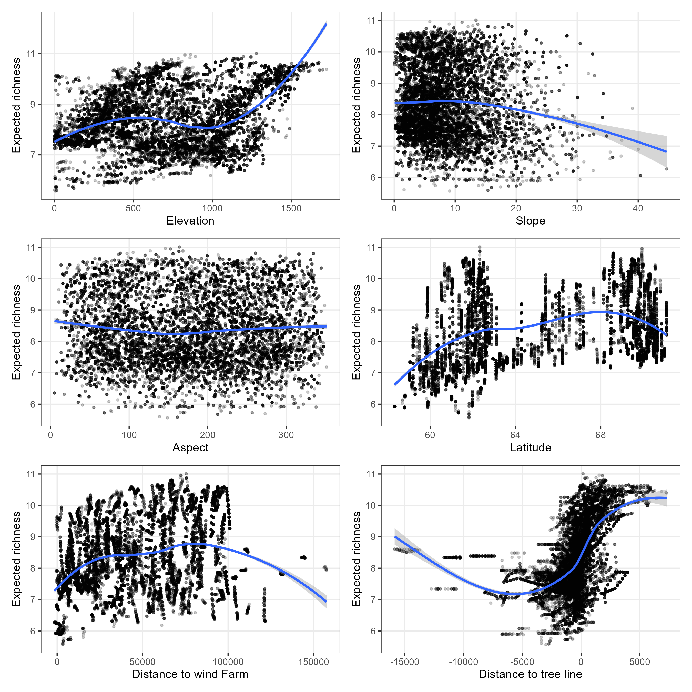

<!--# This is a template for how to document the indicator analyses. Make sure also to not change the order, or modify, the headers, unless you really need to. This is because it easier to read if all the indicators are presented using the same layout. If there is one header where you don't have anything to write, just leave the header as is, and don't write anything below it. If you are providing code, be careful to annotate and comment on every step in the analysis. Before starting it is recommended to fill in as much as you can in the metadata file. This file will populate the initial table in your output.-->

<!--# Load all you dependencies here -->

```{r setup}
#| include: false
#| cache: false
library(knitr)
library(tidyverse)
library(kableExtra)
library(here)
library(anybadger)
library(yaml)
library(tibble)
library(conflicted)
# weird workarounds for cache issues
conflicts_prefer(dplyr::filter)
conflicts_prefer(dplyr::lag)
conflicts_prefer(dplyr::select)
pull<-dplyr::pull

knitr::opts_chunk$set(echo = TRUE)
```

```{r source}
#| echo: false
#| cache: false
source(here::here("_common.R"))
```


<!--# The following parts are autogenerated. Do not edit. -->

::: {layout-ncol="6"}

```{r statusBadge}
#| echo: false
status_badge(as.character(st))
```

```{r versionBadge}
#| echo: false
version_badge(my_version_number = as.character(version[[1]]))
```

```{r dataBadge}
#| echo: false
data_badge(as.character(badges[[1]]))
```

```{r codeBadge}
#| echo: false
code_badge(as.character(badges[[2]]))
```

```{r openScienceBadge}
#| echo: false
open_science_badge(as.character(badges[[3]]))
```

```{r licenseBadge}
#| echo: false
# The following inserts a badge specifying the GPL GNU version 3 license. ecRxiv recommends using this license, but you can decide to use another. Contact ecRxiv for help in insert a badge for a different license
license_badge()
```


::: 
 

> **Recommended citation**: `r paste(auth, " ", year, ". ", name, " (ID(s): ", folder_name, ") ", "v. ", version, ". ecRxiv: ", url, sep="")`


::: {.callout-tip collapse="true"}
## Metadata
```{r tbl-meta2}
#| tbl-cap: 'Indicator metadata'
#| echo: false
#| warning: false
meta |>
  dplyr::filter(Variable %in% c(
    "Indicator ID",
    "Indicator Name",
    "verbatimName",
    "Continent",
    "Country",
    "Ecosystem Condition Typology Class", 
    "Realm",
    "Biome",
    "Ecosystem",
    "verbatimEcosystem",
    "Year added", 
    "Last update",
    "Version",
    "Version comment",
    "Normalised",
    "Spatial aggregation pathway",
    "Precision")) |>   
  kable()

```
:::

::: {.callout-tip collapse="true"}

## Log

<!--# Update this logg with short messages for each update -->
- 15.06.2026 - Original PR

- 22.06.2026 - Complete draft of first version
:::


<hr />

<!--# Document you work below.  -->

## 1. Summary

<!--# 
With a maximum of 300 words, describe the indicator in general terms as you would to a non-expert. Think of this as a kind of common language summary. Follow the four numbers sub-headers below. under point 2, it is possible under  include a bullet point list of the specific steps in the workflow. 
 -->

1. **Background and rationale**:

Birds are a fundamental component of global biodiversity and among the best-studied groups of organisms, providing extensive data for assessing biodiversity patterns and environmental change [@barrowclough2016many; @stork1997measuring]. Their visibility, broad distribution, and familiarity also make them effective for communicating environmental change to non-specialist audiences [@bibby1999making; @santos2026geographical]. Birds contribute to ecosystem functioning through processes such as seed dispersal, pollination, pest regulation, and nutrient cycling, linking their ecological importance to both ecosystem functioning and human well-being [@whelan2015birds; @mariyappan2023ecological; @wenny2011need]. At the same time, bird communities are responsive to environmental variation and disturbance, with changes in their distribution, abundance, and demographic performance reflecting responses to land-use change, climate change, habitat degradation, and changes in food availability [@rigal2023farmland; @johnson2011global; @tscharntke2023agriculture]. This sensitivity, together with established monitoring programmes, makes birds useful indicators of environmental change.

Breeding birds are particularly informative for ecosystem assessment because their occurrence and reproductive performance are closely associated with breeding habitat quality, resource availability, and local environmental conditions [@fuller2012bird; @alerstam1982bird]. Consequently, changes in breeding bird communities can provide an integrated signal of changes in ecosystem conditions during the breeding season. Breeding bird species richness is widely used as a community-level biodiversity measure because it integrates responses across multiple species and can provide a relatively simple metric for ecological assessment [@gregory2003using; @devictor2009measuring]. However, observed richness alone may also reflect differences in detectability, sampling effort, and the regional species pool. Incorporating species-specific occurrence or occupancy probabilities and evaluating expected richness against an explicitly defined ecological reference condition therefore provides a stronger basis for interpreting breeding bird richness as an indicator of ecosystem condition and for assessing spatial and temporal changes in ecosystem integrity.

2. **Methods**:
<!-- What kind of data is used? How is the data customized (modified, estimated, integrated) to fit its purpose as an indicator? -->

- *Data used*: Long-term breeding-bird observations from the Norwegian terrestrial monitoring programme, [Hekkefulgovervåkingen](https://hekkefuglovervakingen.nina.no/Fugl/Default.aspx?ReturnUrl=%2fFugl%2f) (formerly TOV-E), covering multiple species, ecosystems, and years [@kaalaas2022norsk].

- *Species and ecosystem definition*: Bird species were selected using expert-defined species lists representing the characteristic bird communities of the forest and mountain ecosystems. The resulting datasets comprised 18 characteristic forest bird species and 16 characteristic mountain bird species.

- *Data preparation and occupancy modelling*: Observations were converted to detection/non-detection data and analysed using point-level occupancy models implemented in ``spOccupancy`` [@doser2022spoccupancy]. The most recent five years of observations (2020 - 2024) were used as temporal replicates, allowing detection probability to be separated from the underlying occupancy process. Both single-species and multi-species models were evaluated, with spatial and non-spatial formulations considered where appropriate.

- *Model selection and prediction*: Models were compared using WAIC within the respective modelling frameworks. The final models used for indicator estimation were selected by considering model support and comparing the resulting spatial predictions. The selected models were then used to estimate species-specific occupancy probabilities across the study area and derive expected species richness for each ecosystem.

- *Reference condition and indicator scaling*: Reference conditions were defined using expert-elicited species-specific occurrence probabilities, representing the expected occurrence of each characteristic species under the defined reference ecological condition and assuming perfect detection. Expected species richness was scaled relative to this reference richness to produce an indicator ranging from 0 to 1, where higher values indicate a larger proportion of the characteristic bird community expected under reference conditions and lower values indicate greater departure from the reference condition.


3. **Interpretation**:
<!-- Add a very short description of how the indicator values should be interpreted. Here's an example for a bumblebee indicator: An indicator value of 1 signifies an intact bumblebee community. Values decreasing toward zero reflect negative ecological change, specifically the decline of species expected to be present. This metric does not account for potentially positive changes, such as increases in species' abundance or the arrival of new species. Tip: Add text on the line directly following the subheader, and don't introduce blank lines. This way the whole paragraph renders as a block quote. -->

An indicator value of $1$ represents a fully intact breeding bird community in forest or mountain ecosystems, meaning that the expected set of species is present under near-natural conditions. As the value declines toward $0$, it indicates increasing ecological degradation, expressed as a reduction in expected species richness due to changes in environmental conditions such as habitat loss or resource limitation. This indicator primarily reflects the loss of characteristic species and thus signals declining ecosystem quality and integrity. It provides a standardized way to compare ecosystem condition across sites and over time. However, it captures only negative changes; potential positive developments—such as increases in species abundance, colonization by new species, or shifts in community composition—are not reflected in the indicator.


4. **Results and development needs**:
<!-- Briefly, what does the indicator say about the ecosystem condition. What is the current status of  the metric (can it be used or is it still in development), and what immediate tasks remain to improve the indicator or to make the indicator operational -->

The breeding bird indicator provides a spatially explicit measure of ecosystem condition by expressing expected species richness relative to an expert-elicited reference condition. Higher indicator values indicate that a larger proportion of the characteristic bird community is expected to occur under the prevailing environmental conditions, whereas lower values indicate a greater departure from the reference condition. Across the five biogeographic regions, the indicator revealed clear differences between forest and mountain ecosystems. Forest ecosystems showed the greatest regional variation, with median values highest in the South (0.80), followed by the East (0.73) and West (0.72), and lower in Central (0.60) and particularly the North (0.38). Mountain ecosystems showed a narrower regional range, with the highest values in the North (0.68), followed by the East (0.66) and Central (0.62), and lower values in the West (0.58) and South (0.54). These patterns demonstrate that the indicator can distinguish meaningful spatial differences in ecosystem condition and identify regions where the characteristic bird community is relatively close to, or further from, the defined reference condition.

The indicator is operational and can be used to assess and compare ecosystem condition across regions. The immediate priorities are therefore focused on maintaining and improving its application rather than developing the indicator itself. In particular, continued updating with new bird monitoring data, periodic reassessment of the expert-elicited reference values, and evaluation of temporal changes in the indicator will strengthen its long-term application. Clear guidance on interpreting changes in indicator values and incorporating updated model predictions will also support consistent use in ecosystem assessment, monitoring, and management.


## 2. About the underlying data {#sec-underlyingData}

<!--# Give a general introduction the datasets you have used, and provide more specific details in the sub-chapters.  -->

The breeding bird indicator is derived from observations collected through the Norwegian national monitoring programme [Hekkefulgovervåkingen](https://hekkefuglovervakingen.nina.no/Fugl/Default.aspx?ReturnUrl=%2fFugl%2f). This long-term scheme provides standardized data on bird populations across Norway and forms a common foundation for all indicator calculations. To ensure that the indicators reflect specific ecosystem conditions, species are selected based on expert-defined lists that identify those most representative of each ecosystem type.

The monitoring programme was gradually established between $2005$ and $2011$ and currently includes nearly $500$ survey locations distributed across the country. Each location consists of multiple sampling points (typically $12–20$), and most sites are surveyed annually. Data collection is carried out largely by trained volunteer observers following a [standardized protocol](https://hekkefuglovervakingen.nina.no/Fugl/public/papirskjema/MethodologyEng.pdf), ensuring consistency across regions and years. Surveys are conducted once per year during the main breeding season (late May to early June), under suitable weather conditions.

At each sampling point, observers record all birds seen or heard within a fixed time period, while additional observations of selected species are noted during movement between points. The dataset typically includes records of over $200$ bird species. All observations are quality-checked and stored in a central [database](https://hekkefuglovervakingen.nina.no/Fugl/Default.aspx) managed by NINA.


### 2.1 Spatial and temporal resolution and extent

<!--# Describe the temporal and spatial resolution and extent of the data used -->

The indicator is based on data from the Norwegian breeding bird monitoring programme (Hekkefuglovervåkingen), which covers terrestrial ecosystems across the entire country. The monitoring network consists of $492$ fixed survey routes distributed along major latitudinal and altitudinal gradients, providing broad ecological representation. Each route includes $12–20$ point-count locations, resulting in approximately $9,000$ sampling points nationwide.

For this indicator, data from $2020$ to $2024$ are used, providing a recent and consistent time window. The temporal resolution is annual, as each route is surveyed once during the breeding season. Due to logistical constraints, around $370$ routes are sampled each year, ensuring coverage of roughly $80\%$ of the total network.

The indicator is aggregated at the regional and national scale, reflecting the overall ecosystem condition across Norway.

### 2.2 Sampling design

<!-- How was the data sampled? Describe potential sampling biases -->

Bird data are collected using a standardized point-count survey design. Each route consists of a sequence of predefined counting points, typically spaced about 300 m apart and often arranged in a square-shaped layout (ca. $1.5$ km per side). At each point, observers record all birds seen or heard within a fixed observation period ($5$ minutes). In addition, selected species that are harder to detect are recorded while moving between points.

Surveys are conducted once per year during the peak breeding season (late May to early June), under suitable weather conditions. Data collection is largely carried out by experienced volunteer observers following a consistent protocol, ensuring comparability across sites and years.

Potential sources of sampling bias include variation in observer skill, uneven annual coverage of routes, and limitations in accounting for spatial structure in analyses. Furthermore, some habitats may be underrepresented due to accessibility constraints or terrain, which can influence detection probabilities and species representation.

### 2.3 Original units

<!--# What are the original units for the most relevant  variables in the data-->

During field surveys, observers record the number of individual birds seen or heard at each sampling point and survey occasion. These observations are therefore originally recorded as counts of individuals (i.e., the number of birds detected for each species). The observed count data contain a large number of zeros, particularly for rare species. For the purposes of this indicator, the raw counts are therefore transformed into detection–non-detection (presence–absence) data. Each species is coded as either detected (1) or not detected (0) at a given sampling point and survey occasion, irrespective of the number of individuals observed. Thus, a count of one or more individuals is recorded as 1, while a count of zero is recorded as 0.

This transformation provides a standardized response variable suitable for occupancy modelling and is particularly useful for estimating the occurrence of rare species. Importantly, it shifts the focus from the number of individuals observed to whether a species is detected at a site, while the repeated survey design allows the models to account for imperfect detection. In the first stage of the workflow, the detection–non-detection data are used to estimate species-specific occupancy probabilities, rather than abundance. Occupancy probability represents the estimated probability that a species occurs at a site, while accounting for the possibility that the species may be present but not detected during a particular survey. These occupancy estimates are subsequently used to derive metrics such as expected species richness and to develop the ecosystem-level indicator.


### 2.4 Instructions for citing, using and accessing data

<!--# Is the data openly available? If not, how can one access it? What are the key references to the datasets?   -->

The data is publicly available on [GBIF](https://www.gbif.org/dataset/4a00502d-6342-4294-aad1-9727e5c24041) [@breedingBirdData].

### 2.5 Additional comments about the dataset

<!--# Optional. Text here -->

*Diego can help with this*

## 3. Indicator properties

### 3.1 Ecosystem Condition Typology Class (ECT)

<!--# Describe the rationale for assigning the indicator to the ECT class. See https://oneecosystem.pensoft.net/article/58218/
This doesnt need to be very long. Maybe just a single sentence. -->

B1 – Compositional state characteristics.

### 3.1.1 Other condition typologies

<!--# Optional: Add text about other standards or typologies, such as alternative national condition typologies, and how the indicator relates to these -->


### 3.2 Ecosystem condition characteristic

<!--# 

Describe the ecosystem condition characteristic represented in the indicator. See 10.3897/oneeco.6.e58218 for information on what these characteristics might be.
For example, and indicator called 'Trenching in mires' could be made to represent an ecosystem characteristic 'Intact hydrology'. The term 'characteristic' is used similar to the term 'criteria' in Multiple Criteria Decision Making.  

-->

The indicator reflects the integrity and completeness of breeding bird communities within terrestrial ecosystems. It measures how closely the observed species assemblage matches the expected set of characteristic species under near-natural conditions. Lower values indicate a loss of characteristic species and reduced ecosystem integrity, signalling ecological degradation.

### 3.3 Collinearities with other indicators

<!--# Describe known collinearities with other metrics (indicators or variables) that could become problematic if they were also included in the same Ecosystem Condition Assessment as the indicator described here. -->

The breeding bird indicator is likely to be correlated with several other biodiversity and ecosystem condition metrics. In particular, it overlaps strongly with species richness indicators for other taxa (e.g. plants or insects), as these often respond to similar environmental gradients such as habitat quality and resource availability. It may also be collinear with habitat structure metrics (e.g. vegetation complexity or forest age), since bird community composition is closely linked to these factors.

In addition, the indicator can correlate with abundance-based bird indices or other fauna indicators, as well as broader measures of ecosystem integrity or naturalness, because they capture related aspects of biodiversity condition [@Nater2025]. Including multiple highly correlated indicators in the same assessment could therefore lead to redundancy and overemphasize certain ecological dimensions, particularly biodiversity composition.


### 3.4 Impact factors

<!--# Describe the main natural and anthropogenic factors that affect the metric -->

The breeding bird indicator is influenced by a range of natural and human-driven factors that affect bird communities and their habitats.

- Natural factors:

  - Climate variability (e.g. temperature, precipitation, and seasonal timing), which affects breeding success, migration, and food availability
  - Habitat heterogeneity and natural succession, influencing vegetation structure and nesting opportunities
  - Natural fluctuations in food resources, particularly insects and seeds
  - Predation and interspecific interactions, which can shape species presence and community composition

- Anthropogenic factors:

  - Land-use change (e.g. forestry, agriculture, urbanization), leading to habitat loss, fragmentation, or alteration
  - Climate change, altering species distributions, phenology, and ecosystem dynamics
  - Changes in land management practices, such as intensification or abandonment
  - Pollution and other environmental pressures that affect habitat quality and food resources.

Together, these drivers influence species occupancy and richness, making the indicator sensitive to both gradual environmental change and more abrupt disturbances.

### 3.5 Spatial aggregation

<!-- Describe in word the same aggregation pathway presented in the top yaml (the metadata). If you have scaled against the reference value, it is especially important to know if you did any avergaing or summations etc. beforehand. An example text for a rather simple case could be: "The variable is scaled at the initial polygon level and the point estimate is a area-weighted arithmetic mean of all polygins. There is no transformation, and truncation is not needed as the indicator becomes naturally bound between 0 and 1".  -->

Species-specific occupancy probabilities are predicted at each spatial prediction location and summed across the characteristic species to obtain expected species richness. This expected richness is scaled against the expert-elicited reference richness for the corresponding ecosystem type, producing an indicator bounded between 0 and 1. For regional reporting, the resulting spatial indicator values are aggregated using the median, with uncertainty represented by lower and upper quantiles obtained from bootstrap estimates. No additional transformation or truncation is applied because the reference scaling naturally constrains the indicator to the 0–1 range.


## 4. Reference condition and levels

### 4.1 Reference condition

<!--# Define the reference condition (or refer to where it is defined). Note the distinction between reference condition and reference levels 10.3897/oneeco.5.e58216  -->

In this study, the reference condition is defined using expert-elicited information on species occupancy. Experts were asked to estimate the occupancy probability of each bird species under a hypothetical situation of perfect detection, representing the expected occurrence of the breeding bird community under reference ecological conditions.

These expert-derived occupancy probabilities provide a benchmark against which the condition of observed ecosystems can be evaluated. The reference condition therefore represents an ecologically meaningful expectation of the bird community rather than a specific observed site or a fixed reference level.

Indicator values are subsequently interpreted relative to this reference condition, allowing the estimated state of an ecosystem to be compared with the expected state under reference conditions. This distinction is important: the reference condition describes the ecological state against which ecosystem condition is assessed, whereas reference levels are numerical values derived from that condition and used to scale or interpret the indicator.

Using expert-elicited occupancy probabilities provides a consistent baseline for assessing the condition of forest and mountain ecosystems, where a single set of undisturbed or pristine reference sites may be difficult to identify or may not adequately represent the expected breeding bird community across the full geographical extent of the assessment.ides a consistent and ecologically meaningful baseline for assessing the condition of forest and mountain ecosystems.

### 4.2 Reference levels

<!--# 

If relevant (i.e. if you have normalised a variable), describe the reference levels used to normalise the variable. 

Use the terminology where X~0~ refers to the reference level (the variable value) denoting the worst possible condition; X~100~denotes the optimum or best possible condition; and X~*n*~, where in is between 0 and 100, denotes any other anchoring points linking the variable scale to the indicator scale (e.g. the threshold value between good and bad condition X~60^). 

Why was the current option chosen and how were the reference levels quantified? If the reference values are calculated as part of the analyses further down, please repeat the main information here.

 -->

 The indicator is based on expected species richness, derived from species-specific occupancy probabilities. To facilitate consistent interpretation across ecosystems and over time, expected species richness is normalized to a 0–100 scale using two reference levels.

- **X~100~ (reference level – best condition)**:
X~100~ is defined by the expected species richness derived from expert elicitation. Experts provided species-specific occupancy probabilities under a hypothetical scenario of perfect detection and reference ecological conditions. These probabilities are combined to derive the expected species richness representing the benchmark for the breeding bird community under the defined reference condition.

- **X~0~ (worst condition)**:
X~0~ is set to 0 species, representing a theoretical state in which none of the characteristic breeding bird species are expected to occur. This defines the lower bound of the indicator scale.

- **Intermediate values (X~n~)**:
Values between $0$ and $100$ represent expected species richness relative to the expert-elicited reference level. Thus, an indicator value of X~60~ corresponds to an expected species richness equal to approximately $60\%$ of the expert-elicited reference richness.

The use of expert-elicited occupancy probabilities to define X₁₀₀ provides an explicit ecological benchmark for the indicator. It avoids relying on the assumption that currently protected areas necessarily represent an optimal or undisturbed state and instead defines the reference condition directly in terms of the expected breeding bird community.

The normalized indicator can therefore be expressed as:
$$
X = 100 \times \frac{R_{\mathrm{expected}}}{R_{\mathrm{reference}}},
$$

where $R_{\mathrm{expected}}$ is the model-estimated expected species richness at a given location and $R_{\mathrm{reference}}$ is the expected species richness calculated from the expert-elicited reference occupancy probabilities. Consequently, $X_0=0$ and $X_{100}=R_{\mathrm{reference}}$ on the underlying richness scale, with the corresponding normalized indicator value of 100.

#### 4.2.1 Spatial resolution and validity

<!--# 

Describe the spatial resolution of the reference levels. E.g. is it defined as a fixed value for all areas, or does it vary. Also, at what spatial scale are the reference levels valid? For example, if the reference levels have a regional resolution (varies between regions), it might mean that it is only valid and correct to use for normalising local variable values that are first aggregated to regional scale. However, sometimes the reference levels are insensitive to this and can be used to scale variables at the local (e.g. plot) scale. 

 -->

The reference level is defined at the national scale and is therefore a fixed value across Norway. Experts provide one reference occupancy probability for each species, which is used to derive the national reference value for expected species richness. The same reference level is used to normalize expected species richness at the local, regional, and national scales, allowing the indicator to be calculated locally and subsequently aggregated without changing the reference benchmark.


## 5. Uncertainties
### 5.1 General uncertainties
<!--# Describe the main reasons why you might not trust 100% the final value to represent the given ecosystem characteristic for the give ecosystem type. What aspects of this condition metric are most sensitive to subjective decitions? Is the spatial sampling sufficient? Does the choice of modeling framework affect the values? Is the metric relevant do describe ecosystem condition for the give ecosystem type?  -->

Several factors limit how precisely the indicator reflects ecosystem condition. A major source of uncertainty is the expert-based definition of the reference condition, as the species-specific reference occupancy probabilities depend on expert judgement and may not capture the full ecological variation in breeding bird communities across Norway. Similarly, the selection of characteristic species may not fully represent all aspects of ecosystem functioning. The indicator is also influenced by the spatial and temporal coverage of the monitoring data. Although the survey network provides broad coverage, only a subset of routes is surveyed each year, and some habitats or regions may be underrepresented due to accessibility and other sampling constraints.

The indicator also depends on the occupancy modelling framework and its assumptions, particularly assumptions about detection probability, model structure, and covariate effects. Alternative modelling choices may therefore produce different occupancy and expected richness estimates. In addition, the use of detection–non-detection data means that the indicator reflects community composition and species occurrence rather than abundance or demographic status. While breeding birds provide an informative measure of ecosystem condition, they do not capture all components of ecosystem structure and functioning. These limitations should therefore be considered when interpreting indicator values and their uncertainty.


### 5.2 Reported uncertainties
<!-- Describe the nature of the errors you (hopefully) provide alongside the point estimate for the condition metric. It is especially important to clarify if the errors are inferential (referring to the uncertainty of the point estimate) or descriptive (referreing to the data itself). Here' an example text: "What we report as uncertainties in @tbl-finalTable are inferential and refer to the uncertainty around the point estimates. It does not directly describe variation in the data itself. 
However, the variation in the mean is defined by the spatial variation only, and quartiles are obtained by bootstrapping the set of localities within a region, and calculating the indicator for each of 9999 such samples".   -->

The uncertainties reported alongside the indicator values are inferential uncertainties and describe uncertainty around the estimated point value of the condition metric. They should not be interpreted as a direct measure of spatial variation in expected species richness or variation among individual sampling locations.

For each region and for the national estimate, 1,000 bootstrap iterations are performed, with 20,000 samples per iteration, to estimate the intercept term of a beta regression. The resulting bootstrap distribution represents the uncertainty in the estimated condition metric. The 2.5th and 97.5th percentiles of this distribution are reported as the lower and upper uncertainty bounds, respectively, corresponding to a $95\%$ bootstrap interval around the point estimate.

## 6. References

<!--# You can add references manually or use a citation manager and add intext citations as with crossreferencing and hyperlinks. See https://quarto.org/docs/authoring/footnotes-and-citations.html -->

::: {#refs}
:::

## 7. Import and prepare datasets

The workflow can be found in the GitHub repository: https://github.com/NINAnor/breedingBirdIndicator_OccupancyModelling. Download the code and save them in a folder that can be called to run this script (preferably in the relative path of this document using `here::here()`.

Afterwards, the following should be run to set the parameters needed to run the model. The parameters include:

```{r}
#| echo: true
#| code-fold: true
#| eval: false
#| warning: false

################################################################################
# 1. User and path configuration
################################################################################

USER <- "mighty" # options: use a name you prefer
#Specify youur woth USER in the 01_setPaths.R script

source(here::here("scripts", "01_setPaths.R"))

dataFolder    <- path_finder("dataFolder", user = USER)
geoSpatFolder <- path_finder("ninaGeospatialFiles", user = USER)
expertFolder  <- path_finder("expertData", user = USER)
output_root   <- normalizePath(
  path_finder("results", user = USER),
  mustWork = FALSE
)

################################################################################
# 3. Locale and function loading
################################################################################

# Ensure Norwegian characters are read correctly in expert input files.
Sys.setlocale("LC_CTYPE", "Norwegian_Norway.utf8")

# Load all project functions.
function_files <- list.files(
  path_finder("functions", user = USER),
  pattern = "\\.R$",
  recursive = TRUE,
  full.names = TRUE
)

invisible(lapply(function_files, source))


################################################################################
# 4. Analysis settings
################################################################################

# Ecosystem to model.
ecosystemType <- "Forest"   # Options: "Forest", "Mountain"

# Version label used in output folder names.
version <- 1
version_label <- paste0("version_0", version)

# Pipeline switches.
fitModel       <- FALSE
runPredictions <- FALSE
runIndicators  <- FALSE
runPostprocessing  <- TRUE

# Model type switches.
fit_single_species <- FALSE  # TRUE: PGOcc / spPGOcc per species
fit_spatial_model  <- FALSE # TRUE: spatial NNGP model

# Coordinate reference system used throughout the modelling workflow.
modelCrs <- 25833

# Years included in the model.
modelYear <- c(2021, 2025)

# Temporary directory.
TEMPDIR <- tempdir()

# Setting the resolution
pred_resolution <- 100 # in metres¨
aggregation_spacing <- 1000

# Which column of predictions should be used to estimate indicators
indicator_col = "mean"

# How many groups should be used in grouping the species
maxSpeciesInGrps <- 24


################################################################################
# 5. Model covariates
################################################################################

# Detection covariates affect the observation process.
det_covs <- c("DEM", "landCover")

# Occupancy covariates affect the ecological state process.
occ_covs <- c("DEM", "landCover")


################################################################################
# 6. MCMC settings
################################################################################

n.batch       <- 20
batch.length  <- 500
n.burn        <- 5000
n.thin        <- 50 # use 10 for single species.
n.chains      <- 3

n.neighbors   <- 10
n.omp.threads <- 5


################################################################################
# 7. Output paths
################################################################################

species_dir <- if (fit_single_species) {
  "single_species_model"
} else {
  "multiple_species_model"
}

spatial_dir <- if (fit_spatial_model) {
  "spatialModel"
} else {
  "non_spatialModel"
}

path_to_results <- file.path(
  output_root,
  "modelFit",
  version_label,
  ecosystemType,
  species_dir,
  spatial_dir
)

path_to_predictions <- file.path(
  output_root,
  "prediction_outputs",
  version_label,
  ecosystemType,
  species_dir,
  spatial_dir
)

path_to_indicators <- file.path(
  output_root,
  "indicators_outputs",
  version_label,
  ecosystemType,
  species_dir,
  spatial_dir
)

# if runPostprocessing, specify whether you are interested in comparing all outputs from
# the various models within the same ecosystem or that you are just interested in postprocessing
# for the current configurations
compareMultipleOutputs <- TRUE

if(!compareMultipleOutputs){
path_to_postProcessing <- file.path(  output_root,
                                      "postProcessing_outputs",
                                      version_label,
                                      ecosystemType,
                                      species_dir,
                                      spatial_dir)
} else {
  path_to_postProcessing <- file.path(  output_root,
                                        "postProcessing_outputs",
                                        version_label,
                                        ecosystemType,
                                        "multipleOutputs")
}

path_for_logs <- file.path(
  output_root,
  "logs",
  version_label,
  ecosystemType
)

dir.create(path_to_results, recursive = TRUE, showWarnings = FALSE)
dir.create(path_to_predictions, recursive = TRUE, showWarnings = FALSE)
dir.create(path_to_indicators, recursive = TRUE, showWarnings = FALSE)
dir.create(path_for_logs, recursive = TRUE, showWarnings = FALSE)
dir.create(path_to_postProcessing, recursive = TRUE, showWarnings = FALSE)

logfile <- file.path(
  path_for_logs,
  paste0("model_run_", format(Sys.time(), "%Y%m%d_%H%M%S"), ".log")
)
```


<!--# All the data import and preparation should be done in this chapter, before the analysis chapter. As a minimum, add code for importing data, and describe or show the data structure. You may also explain certain variables, what they represent, and their distributions -->

Two primary data sources are used:

1. Breeding bird survey observations.
2. Expert-defined species lists.

A vignette on loading and filtering breeding bird data is [here](https://github.com/NINAnor/breedingBirdIndicator_OccupancyModelling/blob/main/vignettes/data_preparation.qmd).

### 7.1 Hekkefulgovervåkingen

<!--# Import and prepare the first dataset for analysis. Change the header from Dataset A to the name of the actual dataset. -->

See @sec-underlyingData for the data description. 

The breeding bird observations are retrieved directly from the database using the function a defined function `retrieve_breedingBirds_routesAndCounts`:

```{r breedingBirdData}
#| echo: true
#| code-fold: true
#| eval: false
#| warning: false

breedingBirdData <- retrieve_breedingBirds_routesAndCounts(
  con             = con, # connection to the NINA database
  dataFolder      = point_count_dir, #the direectory to save the data or retrived the catched data
  overwrite_cache = FALSE, # option to overwrite the catched data
  save_outputs    = TRUE,
  crs             = modelCrs # The crs for the modelling
)
```


This process retrieves survey routes, point locations, and bird counts and subsequently stores the processed results for future analyses.

Caching ensures that future executions can proceed without repeatedly querying the database.

### 7.2. Ecosystem species list

<!--# Repeat the process for each dataset -->

The ecosystem-specific species list is loaded using a defined function `retrieve_expertSpeciesList`:
```{r expertSciesData}
#| echo: true
#| code-fold: true
#| eval: false
#| warning: false
expertSpeciesData <- retrieve_expertSpeciesList(
  path_to_file = expert_data_path,
  ecosystem = ecosystemType
)

  # The selected species are extracted as:
  expertSpecies <-
  expertSpeciesData$expertSpeciesList$Species
  
  # Filter the data to the model year
  ecosystemBreedingBird <- ecosystemBreedingBird %>%
  dplyr::filter(
    Year >= modelYear[1],
    Year <= modelYear[2]
  )
```

We present the species suggested by the experts and included in the forest and mountain ecosystems in @tbl-expertReferenceVals. There are $18$ forest and $16$ mountain species in the species list. 

The dataset can be processed in a format that `spOccuancy` can use for the model fitting.

### Expert-ellicited reference values

@tbl-expertReferenceVals provides the reference-value dataset comprising of expert-elicited occurrence probabilities for the characteristic bird species included in the forest and mountain ecosystem indicators. For each species, experts assessed the probability of occurrence under the defined reference ecological condition, assuming perfect detection. The resulting probabilities range from 0 to 1 and vary among species and ecosystem types, reflecting differences in their expected association with the respective ecosystems. These species-specific probabilities are subsequently used to derive the expected species richness under reference conditions, which provides the ecological benchmark against which model-estimated species richness is scaled.

```{r tbl-expertReferenceVals}
#| echo: false
#| message: false
#| warning: false

library(dplyr)
library(knitr)

forest <- readr::read_csv("../data/forest/reference_data.csv") |>
  dplyr::mutate(`Ecosystem type` = "Forest")
mountain <- readr::read_csv("../data/mountain/reference_data.csv")|>
  dplyr::mutate(`Ecosystem type` = "Mountain")

ref_vals <- bind_rows(forest |> dplyr::select(Species, `Ecosystem type`, Values),
                        mountain |> dplyr::select(Species, `Ecosystem type`, Values))

knitr::kable(
  ref_vals,
  caption = "Expert-elicited species occurrence-probability reference values used to scale the ecosystem indicators by ecosystem type. Experts were asked to assess the probability that each species occurs within a given ecosystem type, assuming perfect detection.",
  col.names = c("Species", "Ecosystem type", "Reference value")
)

```

## 8. Spatial units

<!--# Describe the spatial units that you rely on in your analyses. Highlight the spatial units (the resolution) that the indicator values should be interpreted at. Potential spatial delineation data (maksing layers etc.) should be introduced under chapert 7. We recommend using the SEEA EA terminology of Basic Spatial Units (BSU), Ecosystem Asses (EA) and Ecosystem Accounting Area (EAA). -->

The analysis is conducted using spatial units aligned with the SEEA EA framework. The Basic Spatial Units (BSUs) are defined at a grid resolution of 100 m, which is the scale at which predictions of species occurrence are produced. Although environmental covariates are originally available at a coarser resolution (1 km), they are resampled to 100 m to match the resolution of the prediction grid and ensure spatial consistency in the modelling outputs. See this [Generating prediction points](https://github.com/NINAnor/breedingBirdIndicator_OccupancyModelling/blob/main/vignettes/generating_prediction_points.qmd) and [Covariate processing](https://github.com/NINAnor/breedingBirdIndicator_OccupancyModelling/blob/main/vignettes/covariate_processing.qmd) vignettes for further details.

```{r}
#| echo: true
#| code-fold: true
#| eval: false
#| warning: false
    
# Get the prediction region
source(here::here(
      "scripts",
      "02_pipeline",
      "01_dataPreparation",
      "02_getPredictionCoords.R"
    ))

# Get the covariates
    source(here::here(
      "scripts",
      "02_pipeline",
      "01_dataPreparation",
      "03_extractCovariates.R"
    ))

```

Ecosystem-specific predictions are constrained using ecosystem delineation layers (Ecosystem Assets, EA). For forest ecosystems, predictions are limited to areas classified under land cover classes 311–313, while for mountain ecosystems, predictions are restricted to mapped mountain polygons across Norway. This ensures that indicator values are calculated only within ecologically relevant areas.

The indicator is primarily interpreted at aggregated scales, such as regional or national Ecosystem Accounting Areas (EAA), where predictions from BSUs are combined. Although results are generated at fine spatial resolution (100 m), they are most robust and meaningful when summarized across larger spatial units that reduce local variability and align with the regional reference conditions.


## 9. Analyses

<!--# 

Use this header for documenting the analyses. Put code in separate code chunks, and annotate the code in between using normal text (i.e. between the chunks, and try to avoid too many hashed out comments inside the code chunks). Add subheaders as needed. 

Code folding is activated, meaning the code will be hidden by default in the html (one can click to expand it).

Caching is also activated (from the top YAML), meaning that rendering to html will be quicker the second time you do it. This will create a folder inside you project folder (called INDICATORID_cache). Sometimes caching created problems because some operations are not rerun when they should be rerun. Try deleting the cash folder and try again.

-->

We refer to these vignettes for details on the model fitted and the calculation of the ecosystem indicators:

- [Bayesian Occupancy Modelling Framework for Breeding Bird Indicators](https://github.com/NINAnor/breedingBirdIndicator_OccupancyModelling/blob/main/vignettes/occupancy_modelling.qmd)

- [Calculating Scaled Ecosystem Richness Indicators](https://github.com/NINAnor/breedingBirdIndicator_OccupancyModelling/blob/main/vignettes/indicator_estimation.qmd)

### 9.1 Occupancy models

#### 9.1.1 Fitting the models

We fitted a Bayesian occupancy modelling framework for breeding bird monitoring data using the `spOccupancy` package [@doser2022spoccupancy]. This workflow supports single-species and multi-species occupancy models, with optional spatial random effects to account for residual spatial dependence among sampling locations.

The primary objective is to estimate breeding bird indicators while accounting for imperfect detection, spatial autocorrelation, and variation among species or ecological guilds. The specification of occupancy and detection covariates, model fitting, posterior inference, and model evaluation. Both spatial and non-spatial formulations are considered, allowing the framework to be adapted to a range of ecological questions and monitoring designs.

To flexibly fit the models, we write a function `fit_ecosystem_spoccupancy` which routes models according to two user choices:

| `single_species` | `fit_spatial_model` | spOccupancy function |
| ---------------- | ------------------- | -------------------- |
| `TRUE`           | `FALSE`             | `PGOcc()`            |
| `TRUE`           | `TRUE`              | `spPGOcc()`          |
| `FALSE`          | `FALSE`             | `msPGOcc()`          |
| `FALSE`          | `TRUE`              | `spMsPGOcc()`        |

```{r fittingModel}
#| echo: true
#| code-fold: true
#| eval: false
#| warning: false


    if (fitModel) {
      source(here::here(
        "scripts",
        "02_pipeline",
        "02_modelFit",
        "01_modelFit.R"
      ))
            # Rest for 1 minute
      Sys.sleep(1 * 60)
    }
```


#### 9.1.1 Model selection

For each ecosystem, competing occupancy models were evaluated using the Watanabe–Akaike information criterion (WAIC). Within the multi-species modelling framework, the candidate models were compared using WAIC, and the model with the lowest WAIC was selected as the best-performing multi-species model. Similarly, for each species within the single-species framework, the four candidate models were compared and the model with the lowest WAIC was retained. This procedure allowed the spatial and non-spatial formulations to be evaluated within each modelling framework.

Because WAIC values from single-species and multi-species models are not directly comparable, the best model from each framework was retained for a final comparison based on their predicted spatial patterns. The resulting prediction maps were examined for consistency in the magnitude and spatial distribution of predicted occupancy. Where the predictions from the two frameworks were broadly similar, the multi-species model was selected for subsequent indicator estimation. Where meaningful differences were observed, the predictions were assessed in relation to model performance and ecological plausibility before selecting the final model.

### 9.2 Predicting over ecosystem region

After fitting the models, we predict over the relevant ecosystem region.
```{r predictions}
#| echo: true
#| code-fold: true
#| eval: false
#| warning: false


    if (runPredictions) {
      source(here::here(
        "scripts",
        "02_pipeline",
        "02_modelFit",
        "02_predictions.R"
      ))
    }
```


### 9.3 Estimating expected species richness

#### 9.3.1 Load biogeographic regions

Biogeographic regions are used to summarize indicators regionally. The source shapefile is read, aligned with the Norway boundary, transformed to the model coordinate reference system, and saved as a GeoParquet file for subsequent analyses.

```{r bioRegions}
#| echo: true
#| code-fold: true
#| eval: false
#| warning: false


bio_regions <- get_biogeographic_region(
  input_file = file.path(
    geoSpatFolder,
    "BiogeographicalRegions",
    "Norway_Biogeography",
    "Original",
    "biogeografiske_regioner_omrade.shp"
  ),
  norway_boundary = norway_boundary,
  modelCrs = modelCrs,
  output_file = file.path(
    dataFolder,
    "processedData",
    "biogeographic_regions",
    "biogeographic_regions.parquet"
  ),
  overwrite = FALSE
)
```

#### 9.3.2 Estimation of the ecosystem indicator

The function `calculate_scaled_ecosystem_richness()` reads species-specific prediction outputs, extracts predicted mean occupancy probabilities, and combines these with expert-elicited species-specific reference occupancy probabilities to calculate expected species richness. Expected richness is then scaled relative to the national expert-defined reference condition, with 0 representing no expected species occurrence and 100 representing the reference level.

Prediction locations are assigned to Nature regions to obtain regional summaries of the indicator. For each region and the national scale, uncertainty is estimated using bootstrap resampling. In each bootstrap iteration, 20,000 prediction locations are sampled and the indicator is estimated from these samples. The resulting bootstrap distribution is used to derive the point estimate and the 2.5th and 97.5th percentiles, which represent the lower and upper bounds of the 95% uncertainty interval.

```{r estimatingIndicators}
#| echo: true
#| code-fold: true
#| eval: false
#| warning: false


        source(here::here(
          "scripts",
          "02_pipeline",
          "02_modelFit",
          "03_estimating_indicators_using_expert_references.R"
        ))
```


## 10. Results

<!--# 

Repeat the final results here. Typically this is a map or table of indicator values.

This is typically where people will harvest data from, so make sure to include all relevant output here, but don't clutter this section with too much output either.

-->

### 10.1 Model selection

Model selection indicated that the importance of including spatial structure differed among species and between ecosystem types (@tbl-forestBestModels). For the forest ecosystem, the selected multi-species model included spatial structure, with a WAIC of $38,423.6$. Among the single-species models, spatial models were selected for six species: *Dryocopus martius*, *Jynx torquilla*, *Muscicapa striata*, *Phylloscopus sibilatrix*, *Pyrrhula pyrrhula*, and *Tetrao urogallus*. The remaining forest species were better supported by non-spatial models according to WAIC.

```{r tbl-forestBestModels}
#| echo: false
#| message: false
#| warning: false

library(dplyr)
library(knitr)

forest <- readr::read_csv("../data/forest/best_models.csv") |>
  dplyr::mutate(`Ecosystem type` = "Forest")
mountain <- readr::read_csv("../data/mountain/best_models.csv")|>
  dplyr::mutate(`Ecosystem type` = "Mountain")

ref_vals <- bind_rows(forest |> dplyr::select(Species, `Ecosystem type`, single_species, spatial, WAIC),
                        mountain |> dplyr::select(Species, `Ecosystem type`, single_species, spatial, WAIC))

knitr::kable(
  ref_vals,
  caption = "Selected occupancy models for forest and mountain bird species based on WAIC. For each ecosystem, the lowest-WAIC model was selected within the multi-species framework and, separately, for each species within the single-species framework. `Is single?` indicates whether the model was fitted separately for each species, while `Is spatial?` indicates whether spatial structure was included in the model. The rows with missing species names represent the selected multi-species models.",
  col.names = c("Species", "Ecosystem type", "Is single?", "Is spatial?", "WAIC")
)
```

For the mountain ecosystem, the selected multi-species model was non-spatial, with a WAIC of $70,524.3$. Spatial structure was nevertheless supported for several individual species, including *Calcarius lapponicus*, *Corvus corax*, *Eremophila alpestris*, *Lagopus lagopus*, *Luscinia svecica*, *Oenanthe oenanthe*, *Plectrophenax nivalis*, *Pluvialis apricaria*, and *Turdus torquatus*. Other mountain species were better supported by non-spatial single-species models. The results therefore show that there was no single spatial modelling structure that was consistently preferred across all species. Spatial dependence appeared important for a subset of species, while non-spatial models provided better support for others. This variation is ecologically plausible because species differ in their spatial distribution, habitat associations, dispersal patterns, and responses to environmental gradients.

Importantly, the WAIC comparison was used primarily to identify the best model within each modelling framework, rather than to rank single-species models directly against multi-species models. The final selection between the best multi-species and single-species predictions was therefore based on their spatial predictions. This provided a more ecologically meaningful basis for selecting the model used to generate the ecosystem indicator, particularly where the competing models had similar spatial predictions.


### 10.2 Effects of covariates on occupancy

#### 10.2.1 Forest ecosystem

The estimated effects of environmental and forest habitat covariates varied considerably among bird species, with some covariates showing more consistent associations than others (@fig-forestOccupancy). Elevation showed pronounced species-specific responses, with several species exhibiting negative associations and others positive associations. This indicates that the elevational distribution of forest bird species was not uniform, but differed according to species' habitat requirements. Latitude also showed substantial variation among species, suggesting geographic differences in occupancy that were not fully explained by the other environmental covariates.

```{r fig-forestOccupancy}
#| fig-cap: 'Species-specific effects of environmental and forest habitat covariates on occupancy in forest ecosystems. Points represent posterior mean coefficient estimates and horizontal lines represent the corresponding uncertainty intervals for three model formulations: multi-species spatial model (red), single-species non-spatial models (blue), and single-species spatial models (green). Estimates are shown for elevation, slope, aspect, dominant tree species, forest type, and latitude. The vertical dashed line indicates a coefficient of zero; estimates to either side indicate negative and positive associations with species occupancy, respectively.'
#| out-width: 100%
#| echo: false
#| warning: false

```

In contrast, the estimated effects of slope and aspect were generally smaller and more centred around zero, although some species showed evidence of positive or negative associations. This suggests that topographic characteristics had a more limited and species-specific influence on occupancy compared with elevation and latitude.

The effects of dominant tree species and forest type also varied among species. Some forest bird species showed relatively strong associations with particular forest types or dominant tree species, whereas estimates for other species were close to zero. These patterns indicate that forest composition and habitat type may be important determinants of occupancy for particular species rather than having a consistent effect across the entire bird community.

Across the three modelling approaches, the estimated effects were generally similar in direction, although the magnitude and uncertainty differed between models. The spatial single-species and multi-species models often produced comparable estimates, while the inclusion of spatial structure resulted in differences for some species and covariates. Overall, the results demonstrate that forest bird occupancy is shaped by a combination of broad-scale environmental gradients and local forest characteristics, with the importance and direction of these effects differing among species.

#### 10.2.2 Mountain ecosystem

Mountain bird species showed pronounced differences in their responses to environmental and anthropogenic gradients (@fig-mountainOccupancy). Elevation was one of the clearest sources of species-specific variation in occupancy. Several species showed positive associations with elevation, including Lagopus muta and Plectrophenax nivalis, whereas Lagopus lagopus and Luscinia svecica showed strong negative associations. These contrasting responses indicate that mountain bird species occupy different positions along the elevational gradient, reflecting differences in their habitat requirements.

The effects of latitude were also variable among species. Several species showed positive associations with latitude, while others, particularly Lagopus lagopus and Luscinia svecica, showed negative associations. This suggests that geographic variation in occupancy remains important even after accounting for other environmental characteristics.

```{r fig-mountainOccupancy}
#| fig-cap: 'Species-specific effects of environmental and anthropogenic covariates on occupancy in mountain ecosystems. Points represent posterior mean coefficient estimates and horizontal lines represent the corresponding uncertainty intervals for three model formulations: multi-species non-spatial models (red), single-species non-spatial models (blue), and single-species spatial models (green). Estimates are shown for elevation, slope, aspect, latitude, distance to wind farm, and distance to tree line. The vertical dashed line indicates a coefficient of zero; estimates to the left and right indicate negative and positive associations with species occupancy, respectively.'
#| out-width: 100%
#| echo: false
#| warning: false

```

In contrast, slope and aspect generally had weaker and more consistent effects around zero. Although some species showed positive or negative associations with slope, most estimates were relatively close to zero. Aspect showed particularly limited effects for most species, suggesting that these topographic variables were less important predictors of occupancy than elevation and latitude for the mountain bird community.
The two variables representing potential anthropogenic and habitat gradients—distance to wind farms and distance to the tree line—showed species-specific responses. Responses to distance from wind farms varied in direction, with some species occurring more frequently farther from wind farms and others showing the opposite pattern. Similarly, distance to tree line was positively associated with occupancy for some species, while others showed weak or negative relationships. These contrasting responses indicate that the influence of these landscape features is species dependent rather than uniform across the mountain bird community.

Overall, the results show that mountain bird occupancy is strongly structured by species-specific responses to elevation and geographic position, while responses to topography, wind farms and the tree line are generally more variable and weaker. The broadly similar estimates among the three modelling approaches suggest that the main ecological patterns were relatively robust to model formulation, although differences in effect magnitude and uncertainty were apparent for some species and covariates. These results highlight the importance of accounting for species-specific habitat relationships when assessing the condition of mountain ecosystems rather than assuming that all mountain bird species respond similarly to environmental change.

### 10.3 Spatial distribution of expected richness and indicator

#### 10.3.1 Forest ecosystem

The forest ecosystem showed a clear south–north gradient in both expected species richness and the scaled indicator (@fig-forestIndicator), with higher values generally occurring in southern and southeastern Norway and lower values in the north. The scaled indicator closely followed the spatial pattern of expected richness, but expresses richness relative to the expert-elicited reference condition. Thus, higher indicator values represent forest areas supporting a larger proportion of the expected characteristic bird community, whereas lower values indicate a greater departure from the reference condition.

```{r fig-forestIndicator}
#| fig-cap: "Spatial distribution of (a) expected species richness (out of 18 species under consideration) and (b) the scaled ecosystem indicator for the forest ecosystem. Expected species richness represents the model-estimated number of characteristic forest bird species, while the scaled indicator expresses this richness relative to the expert-elicited reference condition."
#| fig-subcap:
#|   - "Expected species richness."
#|   - "Scaled ecosystem indicator."
#| layout-ncol: 2
#| out-width: 100%
#| echo: false
#| warning: false




```

#### 10.3.2 Mountain ecosystem

The mountain ecosystem showed a contrasting spatial pattern, with expected species richness generally higher in northern and higher-elevation areas and lower in southern and lower-elevation areas (@fig-mountainIndicator). The scaled indicator followed a similar pattern, indicating that areas with higher expected richness were generally closer to the expert-elicited reference condition. Compared with forests, relatively high indicator values extended further north, reflecting differences in the distribution and ecological requirements of the characteristic bird communities. These spatial patterns provide a basis for identifying areas where the expected bird community is relatively close to, or substantially below, the reference condition.

```{r fig-mountainIndicator}
#| fig-cap: "Spatial distribution of expected species richness and the scaled ecosystem indicator for the mountain ecosystem. (a) Expected species richness (out of 16 species under consideration) represents the model-estimated number of characteristic mountain bird species. (b) The scaled ecosystem indicator expresses expected species richness relative to the expert-elicited reference condition, with higher values indicating conditions closer to the reference state."
#| fig-subcap:
#|   - "Expected species richness."
#|   - "Scaled ecosystem indicator."
#| layout-ncol: 2
#| out-width: 100%
#| echo: false
#| warning: false




```


### 10.4 Expected richness versus covariates

#### 10.4.1 Forest ecosystem

Expected forest bird richness varied along several environmental and habitat gradients (Figure @fig-forestComparison). Latitude showed the strongest relationship, with richness decreasing towards northern Norway. Richness also showed a non-linear relationship with elevation, increasing at low elevations before declining at higher elevations. Relationships with slope and aspect were weaker. Forest composition also contributed to variation in expected richness, with differences among dominant tree species and forest types. Overall, the results indicate that expected forest bird richness is primarily associated with geographic position and elevation, with additional variation related to forest composition and type.

```{r fig-forestComparison}
#| fig-cap: "Relationships between expected forest bird species richness and environmental and forest habitat characteristics. Points represent predicted expected species richness at sampled locations, with transparency indicating overlapping observations. The blue lines show the fitted smooth relationships for continuous covariates; boxplots show the distribution of expected richness across categorical forest characteristics. The relationships are shown for elevation, slope, aspect, dominant tree species, forest type, and latitude."
#| out-width: 100%
#| echo: false
#| warning: false


```


#### 10.4.2 Mountain ecosystem

Expected mountain bird richness was associated with several environmental and landscape gradients (Figure @fig-mountainComparison). Elevation and latitude showed clear non-linear relationships, with richness generally increasing towards higher elevations and northern latitudes. Slope showed a weaker negative relationship, while aspect had little apparent effect. Expected richness also varied with distance to wind farms, although the relationship was relatively weak and levelled off at greater distances. In contrast, distance to the tree line showed a strong non-linear relationship, with richness increasing markedly around the tree-line gradient before reaching a relatively stable level. Overall, mountain bird richness was most strongly associated with elevation, latitude, and position relative to the tree line, while slope, aspect, and distance to wind farms showed weaker or more variable relationships.

```{r fig-mountainComparison}
#| fig-cap: "Relationships between expected mountain bird species richness and environmental and anthropogenic characteristics. Points represent predicted expected species richness at sampled locations, with transparency indicating overlapping observations. Blue lines show fitted smooth relationships for the continuous covariates: elevation, slope, aspect, latitude, distance to wind farms, and distance to the tree line. Shaded areas represent uncertainty around the fitted relationships."
#| out-width: 100%
#| echo: false
#| warning: false


```


### 10.5 Representative indicator values

The indicator reveals clear differences in ecosystem condition among regions, which can help identify where conservation or management efforts may be most needed (@tbl-estimatedIndicators). Forest ecosystems showed the greatest regional differences, with median indicator values ranging from 0.38 in the North to 0.80 in the South. The East and West also had relatively high values (0.73 and 0.72), while Central Norway had an intermediate value (0.60). In practical terms, this suggests that the expected bird community in northern forests is substantially further from the defined reference condition than in southern forests.   For mountain ecosystems, regional differences were smaller. Median values ranged from 0.54 in the South to 0.68 in the North, with the national value at 0.64. Thus, mountain ecosystems showed a more consistent level of the expected bird community across regions, although the South had a noticeably lower value than the other regions.

```{r tbl-estimatedIndicators}
#| echo: false
#| message: false
#| warning: false

library(dplyr)
library(knitr)

forest <- readr::read_csv("../data/forest/representative_indicator_vals.csv") |>
  dplyr::mutate(`Ecosystem type` = "Forest") |>
  dplyr::filter(!region %in% "National")
mountain <- readr::read_csv("../data/mountain/representative_indicator_vals.csv")|>
  dplyr::mutate(`Ecosystem type` = "Mountain")|>
  dplyr::filter(!region %in% "National")

ref_vals <- bind_rows(forest |> dplyr::select(`Ecosystem type`, region, median, lower, upper),
                        mountain |> dplyr::select(`Ecosystem type`, region, median, lower, upper))

knitr::kable(
  ref_vals,
  caption = "Regional estimates of the ecosystem indicator under reference conditions for forest and mountain ecosystems. Values show the median indicator value and the corresponding lower and upper quantiles based on bootstrap estimates, reported at the national and biogeographic-region levels.",
  col.names = c("Ecosystem type", "Region", "Median", "Lower quantile", "Upper quantile")
)

```


## 11. Export file

<!--# 

Optional: Display the code (don't execute it) or the workflow for exporting the indicator values to file. Ideally the indicator values are exported as a georeferenced shape or raster file with indicators values, reference values and errors. You can also chose to export the raw (un-normalised or unscaled variable) as a separate product. You should not save large sptaial output data on GitHub. You can use eval=FALSE to avoid code from being executed (example below - delete if not relevant) 

-->

```{r export}
#| eval: false
```


## 12. Author contributions

<!-- Fill in CReDIT and MeRIT statments to clarify the contributions from individual authors. For MeRIT, see https://www.nature.com/articles/s41467-023-37039-1. For CRedit, see https://credit.niso.org/. You can start with the template structur below, and just delete the rows you dont use.  -->

**CRediT statement**

* Conceptualization: [KPA, Initials]
* Methodology: [KPA, Initials]
* Data curation: [Initials]
* Formal analysis: [KPA, Initials]
* Investigation: [KPA, Initials]
* Software: [KPA, Initials]
* Validation: [KPA, Initials]
* Visualization: [KPA, Initials]
* Resources: [Initials]
* Writing – original draft: [KPA, Initials]
* Writing – review & editing: [Initials]
* Supervision: [Initials]
* Project administration: [Initials]
* Funding acquisition: [Initials]


**MeRIT attribution**

This part supplements the CRediT statement with more granularity for method section.

**Study design**
The study was designed by [AB, CD].

**Data collection / fieldwork**
Field data were collected by [AB, EF] between [years]. Sampling protocol was developed by [CD].

**Laboratory procedures**
DNA extraction was performed by [GH]. Sequencing was conducted by [IJ].

**Data processing**
Raw data were curated and cleaned by [DPJ]. Code for preprocessing was written by [KL].

**Statistical analysis**
All analyses were conducted by [KPA, ] using `spOccupancy`, with verification by [AB].

**Visualization**
Figures were produced by [KPA, ], with input from [CD].

**Reproducibility**
All code was reviewed and validated by [AB, CD].


::: {.callout-tip collapse="true"}
## Session Info
<!-- You can leave this last part as it is, unless you have a good reason to alter it. -->

This information is mainly aimed at developers that need to recreate the R environment that produced the html.
Important note: this information is about the R session that was running when the html was rendered, and if some of the code chunks were not evaluated when the html was rendered, they may have been executed in a different environment.  

```{r sessionInfo}
#| echo: false
sessionInfo()
```

:::
